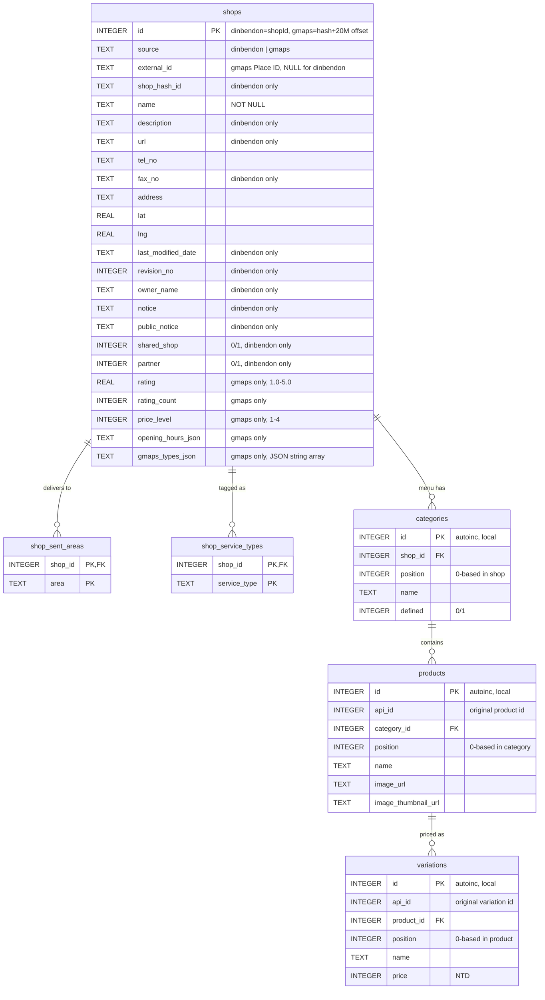

# `shops.sqlite` / D1 schema

Normalized form of `shops.jsonl`. One row per shop in `shops`, with five
child tables for the nested arrays (`sentAreas`, `serviceTypes`,
`categories` → `products` → `variations`).

`shops` carries a **`source`** column to distinguish the two ingestion
paths: `dinbendon` rows from the dinbendon.net API, `gmaps` rows from
the Cloudflare Browser Rendering scrape of Google Maps. dinbendon rows
own all six child tables; gmaps rows leave them empty and instead
populate the `rating` / `gmaps_types_json` / `opening_hours_json`
columns on `shops` itself.

The canonical schema and the per-shop upsert logic live in
[`shops_db.py`](shops_db.py); both [`to_sqlite.py`](to_sqlite.py) (bulk
load) and [`update_from_feed.py`](update_from_feed.py) (incremental
dinbendon) write through the same helpers. The `worker-scraper/`
worker upserts gmaps rows directly against D1 via the
`(source, external_id)` unique index, bypassing the Python pipeline.

## ER diagram



## Design notes

- **`shops.id` namespacing.** dinbendon rows use the API `shopId`
  directly (range `1..650K`). gmaps rows allocate IDs from
  `20_000_000 + FNV-1a(external_id) mod 1_000_000_000`, so there's no
  way for a dinbendon shopId to collide with a gmaps ID. The
  `(source, external_id)` partial unique index is the natural key for
  gmaps and the dedup target for re-scrapes; `external_id` is NULL for
  dinbendon rows so the partial index doesn't touch them.
- **`upsert_shop`** does `DELETE FROM shops WHERE id = ?` before
  reinserting, so an FK cascade cleans every child row in one shot.
  The gmaps upsert uses `INSERT … ON CONFLICT(source, external_id) DO
  UPDATE` since gmaps rows have no children to clean up.
- **gmaps rows have empty children.** No categories / products /
  variations / sent_areas / service_types. EXISTS-based filters in the
  worker (e.g. `WHERE area=… AND EXISTS(SELECT 1 FROM shop_sent_areas
  …)`) naturally exclude gmaps rows from dinbendon-only queries.
- **Categories have no API id.** We use a local autoincrement and keep
  `position` to preserve the menu order from the JSON. `UNIQUE(shop_id,
  position)` enforces one slot per position per shop.
- **Products and variations have API ids that look globally unique** but
  we don't bet the PK on that. Their original ids are preserved in
  `api_id`; primary keys are local autoincrements so re-imports never
  collide.
- **`product.image` is heterogeneous.** Sometimes a `{url, thumbnailUrl,
  width, height, ...}` dict, sometimes a string, sometimes `null`. The
  loader flattens it to `image_url` + `image_thumbnail_url`; width and
  height are dropped.
- **Foreign keys cascade on delete.** Connections must have
  `PRAGMA foreign_keys = ON` (set automatically by `shops_db.open_db`).

## Indexes

| Index | On |
|---|---|
| `idx_shops_name` | `shops(name)` |
| `idx_shops_owner` | `shops(owner_name)` |
| `idx_shops_modified` | `shops(last_modified_date)` |
| `idx_shops_source` | `shops(source)` |
| `idx_shops_source_external` | `shops(source, external_id) WHERE external_id IS NOT NULL` — partial unique, dedup key for gmaps |
| `idx_shops_lat_lng` *(D1 only)* | `shops(lat, lng) WHERE lat IS NOT NULL` — proximity search |
| `idx_sent_areas_area` | `shop_sent_areas(area)` |
| `idx_service_types_type` | `shop_service_types(service_type)` |
| `idx_categories_shop` | `categories(shop_id)` |
| `idx_products_category` | `products(category_id)` |
| `idx_products_name` | `products(name)` |
| `idx_products_api_id` | `products(api_id)` |
| `idx_variations_product` | `variations(product_id)` |
| `idx_variations_api_id` | `variations(api_id)` |

## D1-only tables

The local `shops.sqlite` is dinbendon-only; the following live in D1
only because the `worker-scraper/` and `worker/` workers populate them
directly without a round-trip through Python.

### `gmaps_tile_state`

Per-tile coverage state for the gmaps scraper. One row per tile in the
search grid (~1,710 rows after the Taipei + New Taipei sweep).

| Column | Type | Notes |
|---|---|---|
| `tile_id` | TEXT PK | `tpe-r{row}-c{col}`, row/col relative to bbox origin |
| `lat`, `lng` | REAL | Tile center |
| `radius_m` | INTEGER | Effective coverage radius (~500 m) |
| `last_run` | TEXT | ISO timestamp; NULL = never scraped |
| `status` | TEXT | `ok` / `empty` / `error` / `blocked` / NULL = pending |
| `result_count` | INTEGER | Places returned by the tile (pre-dedup) |
| `last_error` | TEXT | Short error message for `error` / `blocked` |

The cron + manual `mode=stale` enqueue filter on
`last_run IS NULL OR status IN ('error','blocked') OR last_run > 30 days`,
so this table is what makes incremental refreshes cheap.

### `geocache`

Nominatim landmark → lat/lng cache, populated by the `/ask` worker.
Documented inline in `worker/src/index.ts`'s `geocode()`. Negative
hits are cached too — never re-hit Nominatim for a misspelling.

## Example queries

Top delivery areas by shop count:
```sql
SELECT area, COUNT(*) AS n
FROM shop_sent_areas
GROUP BY area
ORDER BY n DESC
LIMIT 20;
```

Cheapest 10 named items across all shops:
```sql
SELECT s.name AS shop, p.name AS item, v.price
FROM variations v
JOIN products  p ON p.id = v.product_id
JOIN categories c ON c.id = p.category_id
JOIN shops      s ON s.id = c.shop_id
WHERE v.price > 0 AND p.name != ''
ORDER BY v.price ASC
LIMIT 10;
```

Full menu of one shop, ordered:
```sql
SELECT c.position AS cp, c.name AS category,
       p.position AS pp, p.name AS item,
       v.name AS variant, v.price
FROM shops s
JOIN categories c ON c.shop_id = s.id
JOIN products   p ON p.category_id = c.id
JOIN variations v ON v.product_id = p.id
WHERE s.id = 637341
ORDER BY c.position, p.position, v.position;
```
