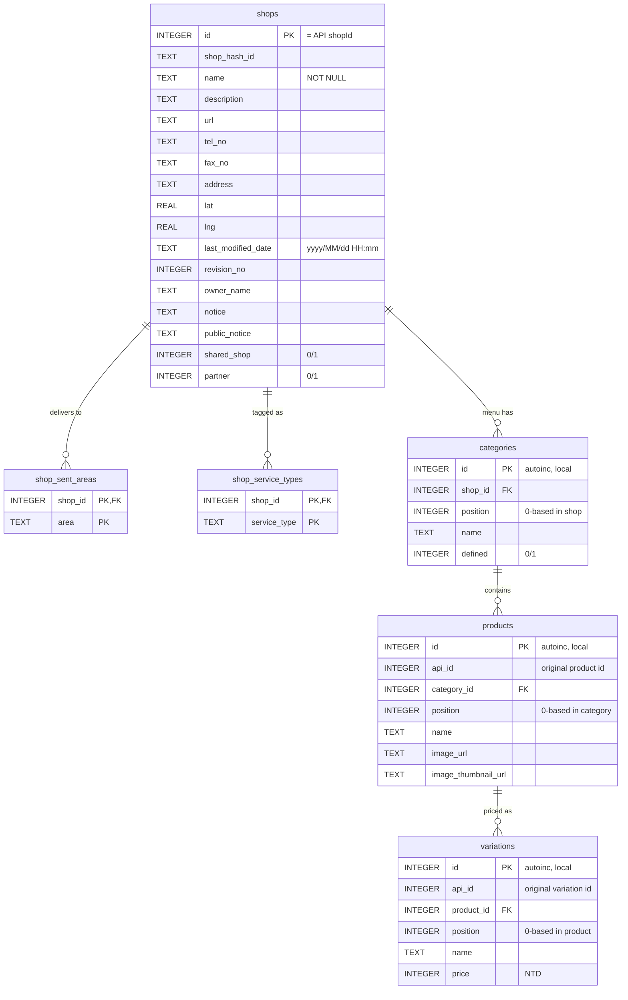

# `shops.sqlite` schema

Normalized form of `shops.jsonl`. One row per shop in `shops`, with five
child tables for the nested arrays (`sentAreas`, `serviceTypes`,
`categories` → `products` → `variations`).

The canonical schema and the per-shop upsert logic live in
[`shops_db.py`](shops_db.py); both [`to_sqlite.py`](to_sqlite.py) (bulk
load) and [`update_from_feed.py`](update_from_feed.py) (incremental)
write through the same helpers.

## ER diagram



## Design notes

- **`shops.id` is the API `shopId`.** It's stable and unique, so the
  table uses it as the primary key directly. `upsert_shop` does
  `DELETE FROM shops WHERE id = ?` before reinserting, so an FK cascade
  cleans every child row in one shot.
- **Categories have no API id.** We use a local autoincrement and keep
  `position` to preserve the menu order from the JSON. `UNIQUE(shop_id,
  position)` enforces one slot per position per shop.
- **Products and variations have API ids that look globally unique** but
  we don't bet the PK on that. Their original ids are preserved in
  `api_id`; primary keys are local autoincrements so re-imports never
  collide.
- **`product.image` is heterogeneous.** Sometimes a `{url, thumbnailUrl,
  width, height, ...}` dict, sometimes a string, sometimes `null`. The
  loader flattens it to `image_url` + `image_thumbnail_url`; width and
  height are dropped.
- **Foreign keys cascade on delete.** Connections must have
  `PRAGMA foreign_keys = ON` (set automatically by `shops_db.open_db`).

## Indexes

| Index | On |
|---|---|
| `idx_shops_name` | `shops(name)` |
| `idx_shops_owner` | `shops(owner_name)` |
| `idx_shops_modified` | `shops(last_modified_date)` |
| `idx_sent_areas_area` | `shop_sent_areas(area)` |
| `idx_service_types_type` | `shop_service_types(service_type)` |
| `idx_categories_shop` | `categories(shop_id)` |
| `idx_products_category` | `products(category_id)` |
| `idx_products_name` | `products(name)` |
| `idx_products_api_id` | `products(api_id)` |
| `idx_variations_product` | `variations(product_id)` |
| `idx_variations_api_id` | `variations(api_id)` |

## Example queries

Top delivery areas by shop count:
```sql
SELECT area, COUNT(*) AS n
FROM shop_sent_areas
GROUP BY area
ORDER BY n DESC
LIMIT 20;
```

Cheapest 10 named items across all shops:
```sql
SELECT s.name AS shop, p.name AS item, v.price
FROM variations v
JOIN products  p ON p.id = v.product_id
JOIN categories c ON c.id = p.category_id
JOIN shops      s ON s.id = c.shop_id
WHERE v.price > 0 AND p.name != ''
ORDER BY v.price ASC
LIMIT 10;
```

Full menu of one shop, ordered:
```sql
SELECT c.position AS cp, c.name AS category,
       p.position AS pp, p.name AS item,
       v.name AS variant, v.price
FROM shops s
JOIN categories c ON c.shop_id = s.id
JOIN products   p ON p.category_id = c.id
JOIN variations v ON v.product_id = p.id
WHERE s.id = 637341
ORDER BY c.position, p.position, v.position;
```
